# Crafting a governance strategy when democratizing AI adoption in an enterprise
Artificial intelligence has already proven itself immensely impactful in the way organizations operate today. Unlike prior technological advances, its **easy adoption**, **short time- to- value realization** and **versatility of application** are paving the way for citizen developers to create useful applications themselves. This empowers the business users who now automate workflows, add functionality atop their favorite applications, get targeted queries answered across multiple datasets almost instantaneously and on their own, without the need for a traditional IT function. On one hand, this brings in flexibility and speed to the activities inside an organization, but on the other hand, it raises the risk of unmanaged data leaks and excessive expenses incurred because of unfettered usage.

The focus therefore shifts towards "managing" this innovation and productivity boom so that an organization can encourage greater adoption of AI amongst its business users while being confident of preventing any potential misuse. This article summarizes the considerations that must be applied when creating an AI adoption strategy while anticipating and overcoming the unexpected "gotchas" in a fair- sized enterprise. 

##### Table of Contents  
- [Common AI uses](#common-ai-uses)
- [The conflicting reality](#the-conflicting-reality)
- [The main stakeholders](#the-main-stakeholders)
- [The basic principles (or rules)](#the-basic-principles-or-rules)
    - [Data governance](#data-governance)
    - [Updates or actions on the SoRs](#updates-or-actions-on-the-sors)
    - [App lifecycle](#app-lifecycle)
    - [AI governance](#ai-governance)
- [The core components](#the-core-components)
    - [Organization data](#organization-data)
    - [AI project hub](#ai-project-hub)
    - [AI gateway](#ai-gateway)
- [The full architecture](#the-full-architecture)

## Common AI uses
Artificial intelligence is advancing at an ever- accelerating pace. Break- through innovations in their capability are almost a staple of everyday news headlines. However if we consider the most rudimentary uses for AI, only a few distinct categories emerge. Note that real- world applications may often fall into more than one category mentioned here. 

| Category | Author | Purpose | Example | Included in the AI adoption strategy |
| -- | -- | -- | -- | -- |
| **Vibe- coded app** | Citizen developer | Business users often require their everyday work applications to behave in a more intuitive way and favor greater automation for the labor-intensive part of such interactions. They build apps often with bespoke user interfaces that favor productivity. AI is used to create the app but AI is not used inside the app.  | The procurement manager wishes to auto-approve a large inflow of low- value purchase orders to specific pre-approved vendors, thus saving a considerable amount of time. _**She creates an app that reads data from the ERP and approves the orders into the ERP**_. | ✅ |
| **Generative AI** | Citizen developer | Users want to bring generative AI capabilities to their daily work by getting them triggered autonomously within the applications that they normally use or by an AI agent that makes helpful suggestions. | The warehouse receiving clerk receives daily emails from vendors informing the company of the schedule and size of the shipments they are making in the coming weeks. The clert plans the warehouse space and workers in advance based on this information. _**She creates an agent that reads the natural language emails in her inbox and makes a daily summary against each purchase order being received**_. | ✅ |
| **Chatbot** | Citizen developer | Users raise questions in natural language to gain insights into data that would otherwise be hard to analyze, possibly because the data is spread in disconnected data sets. Chatbots may be created unique to a functional domain or even a sub-team inside it, based on the data they need access to. | An order desk employee needs to answer a call from a customer regarding the progress of a customer order that can be gleaned from a CRM system in which the order is booked, an ERP system which tracks the execution of manufactured units and a transportation management system to track shipping status. _**She asks a chatbot that has access to the 3 systems**_ to the extent needed to track progress of orders and quickly gets a response to relay to her customer. | ✅ |
| **Pre- built** | Vendor | "Procured" applications being used by business users already have standard AI functionality embedded inside.  Vendors usually provide an assurance of data privacy as part of their customer service agreement. | A recently procured product life cycle management system contains functionality to identify closely resembling products based on standard attributes like bill of materials, variants like colors & shapes, technical specifications etc. The feature is used to remove duplicates and keep the product catalog lean. _**The admin needs to simply flip a switch to enable the functionality before use**_. | ❌ These are typically outside the ambit of a company's AI adoption strategy because the interaction with the LLMs happens natively inside the application and often cannot be intercepted. |
| **Custom data model** | Data analysts | Applications built to use AI in a non-natural language based context, usually by creating models from scratch based on customized and private data sets to yield predictions or forecasts. | A company needs to set its yearly sales targets for the coming period. It analyzes its annual sales data for its flagship products, according to _**a bespoke machine learning algorithm**_, that looks at narrow behavioral traits of its niche customer base. | ❌ As this is often done by data analysts in the IT function who are expected to be fluent with AI, safeguards are assumed to have been placed already. |

## The conflicting reality
As may be seen from the use cases above, deriving the true value from AI requires it to first assimilate facts from a wide range of data sources as well as sufficiently large samples of data in those sources, eventually yielding results that are holistic in nature. If an organization has not yet created an AI adoption strategy, it is likely that they are yet to strike the right balance between conflicting forces that push them to either adopt AI or exercise caution against it. 

* **Leadership push**. The senior management are coerced by their shareholders to demonstrate "competitiveness" or adopt a more "tech- embracing attitude" with respect to their peers. 
* **Enthusiastic citizen developers**. Frontline workers in the business have had a positive experience with AI and are raring to create or use even more tools to enhance their productivity. 
* **Heterogenous application landscape**. There may be too many discrete (and even duplicate) systems that information lives in. Also, not all of them may be in the same state of readiness to securely extract data from.
* **Unprepared for governance**. The IT function has reservations against unbridled use of tokens or leakage of sensitive company data (often intellectual property) to external models or even to unauthorized internal employees. Without sufficient guardrails, they may resist AI exposure.

## The main stakeholders

The following table lays out the primary participants in the AI adoption strategy. While most of the stakeholders may be familiar, the AI- Center of Excellence (AI-CoE) team may be a new construct and needs to be formed in a matrixed way comprising of representatives from multiple functions.

<small>[[Expand image](https://raw.githubusercontent.com/DuttaSoumya/AI-Architecture/refs/heads/main/.assets/Stakeholders.svg)]</small>

## The basic principles (or rules)

Let us list out the simplest set of principles which will drive how the AI adoption strategy should be articulated. You may wish to evaluate the applicability of each of these principles to your organization and thereby craft a custom strategy for your own use. A degree of healthy skepticism is a good thing when an organization is considering building a strategy around the use of AI. Quite a few examples of autonomous agents have been seen to actively pursue creative means to bypass the governance limits imposed on traditional systems. Simply put, AI is a new beast and even its creators are advocating for vigilance when using it. There is no reason, therefore for an organization to put its guards down, which is why the principles outlined below should be periodically reviewed and honed over time.

### Data governance
* **Data- gateway**. It is difficult to manage a large number of AI apps having access to multiple scattered applications in a fragmented landscape. A _managed_, _centralized_ data repository could be the solution. It either pulls such data from the original systems of record (SoR) on- demand or keeps the data replicated internally at an acceptable periodic cadence. Some other benefits that follow from this approach are,
    - Similar SoR applications may be consolidated into a single [star-schema concept](https://en.wikipedia.org/wiki/Star_schema) which is universally understood by the organization. Transformations used to achieve this can be re-used multiple times instead of each app building its own transformation when interacting with a different SoR.
    - Most SaaS applications place limits on the number of direct (Api/ OData) calls to query data. Such limitations may be bypassed by actually replicating the data inside the data- gateway.
    - Older applications may lack the esssential security infrastructure that inspires confidence when exposing them to AI.
* **At- rest data access control**. Requests for data made to the gateway are served only if the requestor also has access to the original data source. Thus user access controls in the original SoR should be replicated to the data gateway. 
* **Privacy**. A data- gateway is required to maintain the same classification of data sensitivity as the original application. The organization maintains certain data points to be sensitive to its business and requires that sensitive data are either omitted or redacted when interacting with AI apps communicating with external LLMs. 
* **User due diligence**. Users that have access to the managed SoR apps could directly extract data from those apps and dump them into data files (say JSONs, CSVs etc.) and then feed the data into AI apps, thus inadvertently disclosing potentially sensitive data. Such practices should be actively discouraged by monitoring user calls to external AI LLMs. 
* **Standard pre-built AI**. Elevating publicly available data warehouses or analytical platform products to become data- gateway often comes with the dual advantages of 
    - ability to quickly create data synchronization flows using standard connectors to a multitude of systems, and
    - ready- to- use AI capabilities in these products that can allow users (and apps) to run natural language queries, without the need of extracting the data and then processing it through a separate LLM. Some examples include [Cortex AI](https://www.snowflake.com/en/product/features/cortex/) in [SnowFlake](https://www.snowflake.com/en/) and [Copilot](https://learn.microsoft.com/en-us/fabric/fundamentals/copilot-fabric-overview) in [Microsoft Fabric](https://www.microsoft.com/en-us/microsoft-fabric).
* **Unified data catalog** A centralized data- gateway also maintains the catalog for the data contained in it, so potential users may find out the exact data points that they need access to, and may place access requests in the source SoR systems accordingly.
* **Avoid license multiplexing**. Some vendors like [Microsoft](https://www.microsoft.com/en-us/licensing/product-licensing/power-platform) may place restrictions on use of data by user accounts lacking appropriate licenses when the data has been extracted from the SoR apps in a non- standard way. This may impact how the data- gateway is designed. Check this with your SoR vendor.

### Updates or actions on the SoRs
* **Human in the loop**. All updates by the app to other SoR apps must be approved by the business user and registered as having been performed by that user's credential. This way the audit logs native to the SoR app would show the data as modified by the user and thus, the user is still held accountable for the outcome of the app use.
* **No direct SoR update**. Apps must not bypass the business validation logic already present in the SoR when updating data inside it. In other words, citizen developers should only create apps that interact with SoRs using _standard_ user interface or Apis in the respective SoR, and not create apps native to the SoR that can potentially update their underlying database directly. Vibe- coded Apps native to specific SoRs typically require a _deployment_ step on the SoR and are out of the scope of the AI adoption coverage here; they must follow the usual route of IT approvals.

### App lifecycle
* **Approvals necessary**. To prevent data leakages about internal processes or data, it is important to know which apps share what data to _external_ LLMs. In case such interaction actually benefits the organization, a formal request data by the citizen developer may be approved by the AI-CoE.
* **In- transit data access control**. Data access controls for users in the SoR must be respected when the same user wants an AI agent to process this data on his or her behalf. 
* **Mark AI suggestions clearly for feedback**. The user of the app should always be able to clearly distinguish the "usual" data from AI- generated suggestions shown in the app. The user must always be able to provide feedback on the quality of the AI suggestion for future improvement. Automated feedback may also be registered by checking _how much_ of the AI suggestion was accepted _verbatim_ by the user.
* **LLM or not**. Natural language models are actually a subset of what AI covers. Standard AI services dedicated for common tasks like language translations, image and speech recognition, text extraction, etc. are often cheaper and more accurate than issuing LLM prompts to achieve similar results.
* **App support**. Since the apps are created often by business users, some of them _acting_ as citizen developers, the business should also responsible for maintaining the apps in the future. AI-CoE may facilitate this process by providing a common source control repository destination to hold the source code.
* **App usage**. The AI-CoE publishes a dashboard of the app usage to be consumed by the owning business teams. If an app loses users, either the app is improved to make it more appealing or it is inactivated to prevent further organization expense. Active monitoring becomes especially relevant as there are [studies](https://medium.com/@Fransantolo/95-of-corporate-generative-ai-projects-fail-mit-study-finds-47ad5d50db32) that show that AI apps look great during demos, but lose their charm over time. Here are some examples of the data that should be available on the dashboard,
    - `Invocations`. Number of times app has been invoked in a month
    - `Universality`. Number of _different_ users that have used the app in a month
    - `Trust`. Do business users trust the output? Or do they have to often dramatically alter the suggestions made by the AI app?
    - `Cost`. How much is the app costing the organization in terms of token or AI credit usage?
    
    These metrics help in quantifying the "value added" by the app to the organization.
* **App library**. All apps made by citizen developers should be placed in a public collection and each of them described in a business- readable language to encourage others to
    - Be inspired by how such apps followed the best practices laid out by the AI-CoE (real - life examples)
    - Avoid re-inventing the wheel by creating yet another app to cater to the same requirements as an older app created by someone else, instead of improving it.

### AI governance
* **Legal requirements**. The countries in which organizations operate may be subject to specific local regulatory requirements (like the [EU AI act](https://artificialintelligenceact.eu/)). This is why input from the legal team is crucial when AI-CoE formulates policies.
* **AI- gateway**. All LLM calls (especially to external Apis) may only go via an AI- gateway, maintained by the AI-CoE, that applies governance policies uniformly to them. Since the AI adoption is expected to quickly gain volume when the gates are opened, it is highly recommended to have these policies checked for in an automated way that minimizes human interactions.
* **Throttling token usage**. There may be a need to "budget" token or AI credit usage base on the app or the department that consumes it, as some apps may provide more business value than others. See **App usage** point above.
* **Data redaction**. Policies related to preventing or redacting sensitive data before it leaves the premises can be effectively enforced through this AI- gateway based on the data classifications maintained in the data- gateway.
* **Logging**. LLM calls are tracked universally for the following data on which the **App Usage** dashboard is created.
    - incurred cost of the call so that it can be attributed to the app or to the organization using the app, 
    - data shared and received, 
    - and perhaps most importantly, the quality of the AI suggestion as perceived by the user.
* **Internal LLM**. If an organization is concerned about token costs, sensitivity of the data that the LLM processes, or using overly complicated apps for simple AI tasks, an internal LLM stationed on- premises is a great alternative to using online vendor- provided LLM alternatives.

## The core components
The core components in an AI adoption strategy may then be classified into the following groups. You may directly go to [the AI adoption architecture](#the-full-architecture) to get the full picture.

### Organization data
Organization data can be classified into 3 categories
1. **Managed SoR apps**. Managed system of record (SoR) apps like ERP, CRM, pricing systems etc. These are usually structured into relational data and such systems are usually maintained by the IT.
1. **Unstructured**. There could be files shares having unstructured data, like data lakes or file shares.
1. **Unmanaged**. This category refers to data handled by indivudual users, like private mailboxes, private dumps of data taken from either of the other 2 categories. We rely solely on user discretion to share such data to external parties, as per company policy. As a result they are the least preferred way of sharing data with AI apps.

All of the data is held behind the data- gateway to prevent direct exposure to AI apps or agents.

<small>[[Expand image](https://raw.githubusercontent.com/DuttaSoumya/AI-Architecture/refs/heads/main/.assets/OrganizationData.svg)]</small>

### AI project hub
The project hub is the collection of all apps and agents built by the citizen developers that addresses the different types of [use cases](#common-ai-uses) as explained previously. Having these collected in a single repository helps in applying the [app lifecycle principles](#app-lifecycle) uniformly. The following diagram describes
- the how the business users and citizen developers interact with the apps, and
- the artifacts in the public domain that inspire developers to create new apps and improve existing ones.

<small>[[Expand image](https://raw.githubusercontent.com/DuttaSoumya/AI-Architecture/refs/heads/main/.assets/AiProjectHub.svg)]</small>

### AI gateway
The apps or agents using generative AI require to be managed to control the data churned by the external models and also the expense incurred out of token usage. In addition, all calls are to be logged so the interactions can be audited. Such logs can also function as a test scenarios ([AI evals](https://www.anthropic.com/engineering/demystifying-evals-for-ai-agents)) for future improvements to the apps.

<small>[[Expand image](https://raw.githubusercontent.com/DuttaSoumya/AI-Architecture/refs/heads/main/.assets/AiGateway.svg)]</small>

## The full architecture
Let us combine the stakeholders, the components and the principles derived together in a unified diagram so that all interactions become visible. The natural next steps is to evaluate your organization readiness for each node and edge in this diagram and thereafter make a plan of action for the missing parts. 

<small>[[Expand image](https://raw.githubusercontent.com/DuttaSoumya/AI-Architecture/refs/heads/main/.assets/FullArchitecture.svg)]</small>

